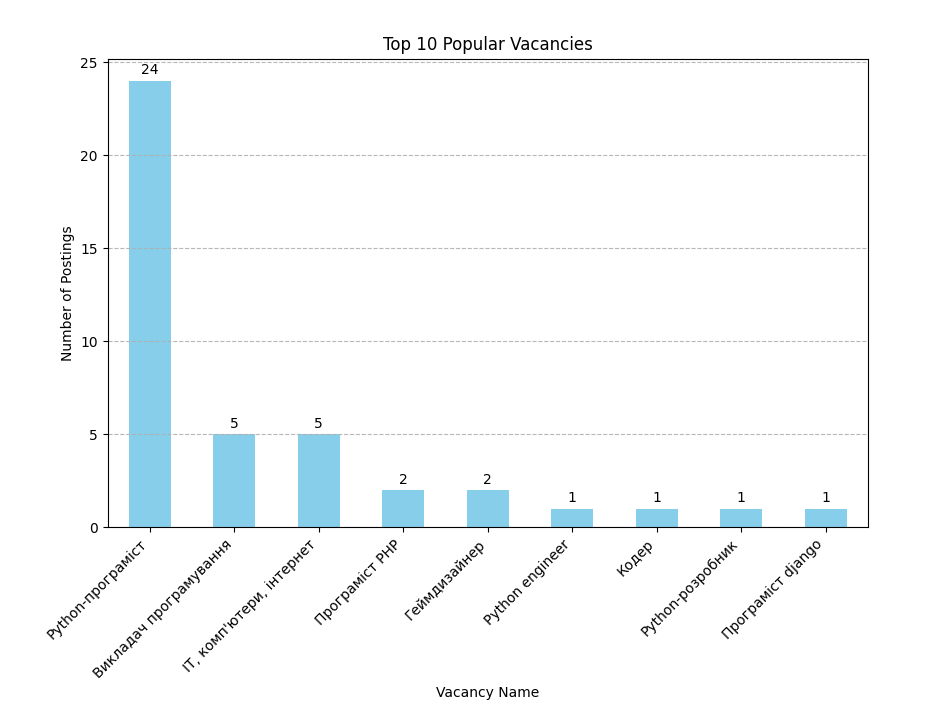

# Work.ua Scraper


## Project Description:
This project scrapes job listings from the work.ua website, creates a CSV file based on the scraped data, and then generates three visualizations based on this data.

### Data Collection:
The scraper collects job listings including their title, required technologies, posting date, and the company's name.

## Quick Start 💨:
1. Clone the repository:

```shell
git clone https://github.com/Anna728560/Web-Scraping-Data-Analysis
```

2. Navigate to the project directory:

```shell
cd scrapy_project
```

3. Set up a virtual environment:

```shell
python -m venv venv
source venv\Scripts\activate # or venv/bin/activate
```

4. Install dependencies:
```shell
pip install -r requirements.txt
````

## Spider Configuration 🕸:
To run the spider and save the data to a CSV file, use the following command:

```shell
scrapy crawl tch -O technologies.csv
```


## Visualizations 📊:
#### These instructions will help you easily run the scripts to generate the visualizations.

To run diagrams navigate to the directory:
```shell
cd scripts_to_build_diagrams
```
1. **Top 30 Popular Technologies:** This bar chart displays the top 30 most popular technologies required by the job listings.
```shell
  python bar_30_popular_technologies.py
```


2. **Top 25 Popular Technologies:** This pie chart displays the distribution of the top 25 most popular technologies required by the job listings.
```shell
  python pie_25_popular_technologies.py
```


3. **Top 10 Popular Vacancies:** This bar chart displays the top 10 most popular job vacancies based on the frequency of job postings.
```shell
  python bar_10_popular_vacancies.py
```



## List of Technologies:
Here are the technologies used in the job listings:
- Python
- Scrapy
- Selenium
- Pandas
- Matplotlib
